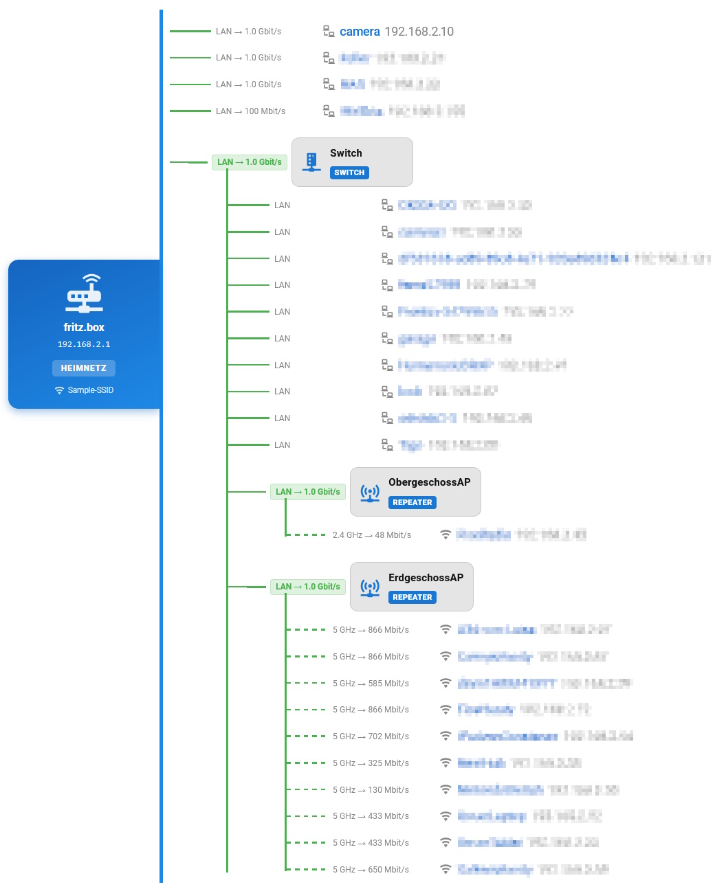

# FRITZ!Box Mesh card
Home Assistant card to display the network Mesh of your Fritz!Box



:exclamation: **This card is based on the work of [werthdavid](https://github.com/werthdavid). 90% of the implementation has been extracted from [homeassistant-fritzmesh](https://github.com/werthdavid/homeassistant-fritzmesh).**

## Using the card

- Find the ID of the topology entity of the mesh master (e.g. `sensor.fritz_box_connected_devices`)
- Create a card in the **Lovelace UI** with the following YAML:
```yaml
type: custom:fritzmesh-card
entity: sensor.fritz_box_connected_devices
```

### Visual editor options

The card supports full UI configuration in Lovelace Visual Editor:

| Option | Values | Description |
|---|---|---|
| Name detail display | `Connected mesh node`, `Connection state` | Defines which entity is shown in **More Info** when clicking a device name |
| Node sorting | `Default`, `By name`, `By IP`, `By MAC` | Sort order for repeater sections and client lists |
| Transfer metric mode | `Aggregate`, `Uplink only`, `Max single client`, `Average client` | Metric shown as TX/RX label on master and repeater cards |
| Hide offline nodes | `on`, `off` | Hides disconnected repeaters and disconnected/unassigned client devices |
| URL template | e.g. `http://{ip}`, `https://{ip}` | Used when clicking IP addresses (IPs are always clickable) |
| Line / Accent / Text colors | color pickers | Card appearance customization |
| Master panel gradient start/end | color pickers | Color customization for the blue mesh-master panel |
| Font size scale | `80`–`140` | Scales card text size in percent |
